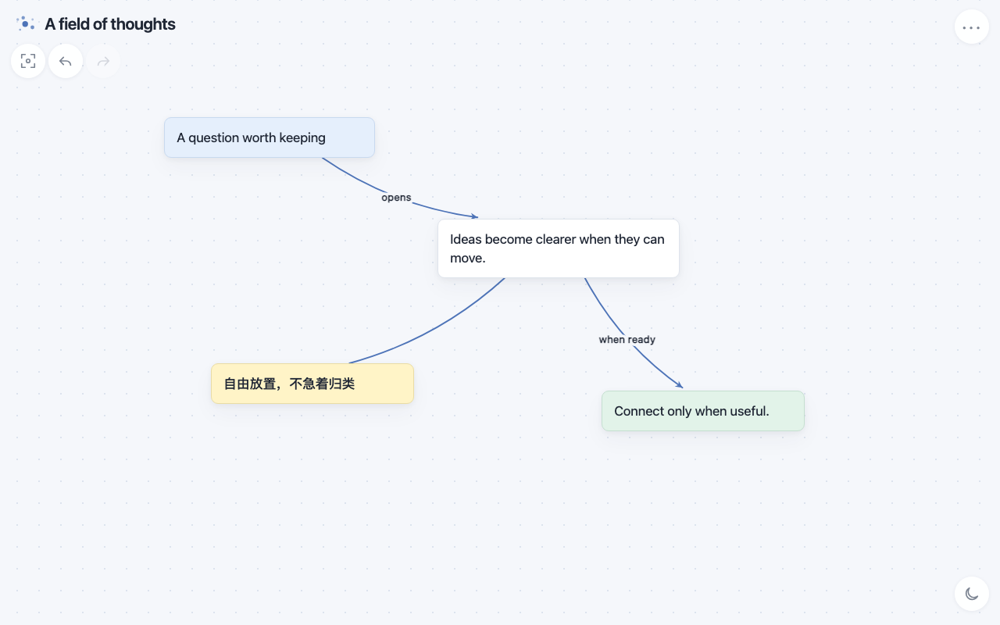

# Scattered

[Open Scattered](https://kydchen.github.io/scattered/) · [简体中文](README.zh-CN.md)

Scattered is a minimalist, local-first canvas for freely arranging and connecting notes—built for Pencil, touch, and mouse. Write a note, move it anywhere, connect it only when useful, and keep thinking.



There is no account requirement, template, or forced hierarchy. By default, boards stay in the current browser and remain available offline after the app has been loaded once. If the cloud icon is available, connecting Google Drive once on each device can keep the workspace in sync; this is entirely optional.

## Install it like an app

You can use Scattered directly in a browser, but installing the web app gives it its own icon and standalone window without requiring an App Store download.

- **Chrome on Windows, macOS, or Linux:** open Scattered, then choose **More → Cast, save, and share → Install page as app**. Some Chrome versions also show an install icon in the address bar. [Chrome instructions](https://support.google.com/chrome/answer/9658361?co=genie.platform%3DDesktop&hl=en)
- **Chrome on Android:** choose **More → Install and create shortcut → Install**. [Chrome Android instructions](https://support.google.com/chrome/answer/9658361?co=GENIE.Platform%3DAndroid&hl=en)
- **Safari on iPhone or iPad:** choose **Share → Add to Home Screen**, turn on **Open as Web App**, then tap **Add**. [Apple iPhone instructions](https://support.apple.com/guide/iphone/iphea86e5236/ios) · [Apple iPad instructions](https://support.apple.com/guide/ipad/ipad8f1f7a29/ipados)

## What it can do

- Create and edit notes with a double-click or double-tap
- Move notes freely and resize long notes
- Connect notes, cycle arrow direction, and label connections; drag a connector onto empty canvas to create the next linked note
- Lasso, marquee-select, or long-press to select multiple notes
- Move, recolor, duplicate, connect, disconnect, or delete a selection together
- Keep multiple local boards and switch between them from the Scattered mark
- Optionally sync the whole workspace through the user's own Google Drive, without creating a Scattered account
- Clear the current board without changing its title, or delete the board itself—both actions keep a local recovery copy
- Undo a clear immediately or restore a recovery copy after clearing, importing over, or deleting
- Search note text and jump between matches
- Undo, redo, fit the whole board into view, and switch between light and dark modes
- Export the current canvas as editable JSON, SVG, or Mermaid Markdown

## Input modes

Scattered uses the same model across devices, with controls adapted to each input style:

| Input | Selection and navigation | Fast actions |
| --- | --- | --- |
| Apple Pencil + touch | Lasso with Pencil; pan and pinch with fingers | Use the visual selection bar; write in notes and search with Scribble |
| Touch only | Long-press a note to enter multi-select; drag to pan and pinch to zoom | Use the visual selection bar and top-right menu |
| Keyboard + mouse | Shift-click or drag a marquee; hold Space and drag to pan | `N` creates; `Enter/F2` edits; `Space/Shift+Space` selects; arrows move; `L` starts a connection; `Cmd/Ctrl` + `A/C/V/D/F/Z` |

## Local data and privacy

Boards, recovery copies, and preferences are stored locally in the browser. Scattered works fully without an account or network connection. Clearing site data or browser storage can remove local boards, so export important canvases as JSON when moving them to another browser or device.

When optional Google Drive sync is enabled and the user connects it, workspace snapshots go directly from the browser to that user's hidden Drive app-data folder. The small authorization broker exchanges an encrypted session for short-lived Drive access but has no content database and does not receive note text or board structure. Disconnecting removes the credential from that device; the Google grant can be revoked for all devices from the user's Google Account permissions.

Cloudflare Web Analytics is enabled for basic traffic measurement. Scattered's application code does not send note text, board structure, or exported files to an analytics service.

## Import and export

- **JSON** preserves the current editable canvas. Importing it replaces the current canvas and keeps a local recovery copy; older workspace backup files remain supported and add their canvases to the local list.
- **SVG** exports the complete board as a lightweight vector image, automatically fitted to its content.
- **Mermaid Markdown** turns notes and connections into a diagram that can be used in Markdown documents and AI-assisted workflows.

On browsers that support file sharing, export opens the system share sheet; elsewhere it downloads the file directly.

## Browser support

Scattered is designed for modern browsers on iPadOS, iOS, Android, Windows, macOS, and Linux. The current release is tested most heavily on iPad with Apple Pencil and desktop Chromium browsers. Android, Windows, and other modern browsers are supported targets, but the full device-and-browser matrix is still growing.

The visual interface stays icon-first. Accessible names, canvas status, keyboard controls, and focus handling are available in English or Simplified Chinese according to the browser language.

## Local development

```sh
npm start
```

Open `http://localhost:4173`, then run the regression checks with:

```sh
npm test
```

Optional Drive sync is disabled when `sync-config.js` has no broker URL. Deployment and security setup are documented in [docs/google-drive-sync.md](docs/google-drive-sync.md).

## Inspiration

Scattered is inspired by [Scapple](https://www.literatureandlatte.com/scapple/overview), a tool I have loved for years. I wanted its freeform note-and-connection flow in a web app that feels natural with Apple Pencil while remaining useful on other devices, so I built this independent project.

Scattered is not affiliated with Scapple or Literature & Latte.

## License

Scattered is open source under the [MIT License](LICENSE). Issues and focused pull requests are welcome; see [CONTRIBUTING.md](CONTRIBUTING.md).
